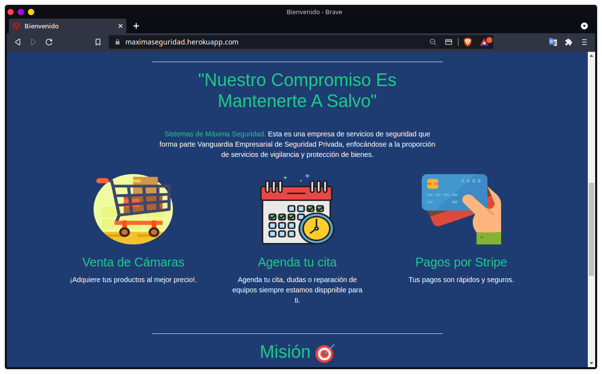
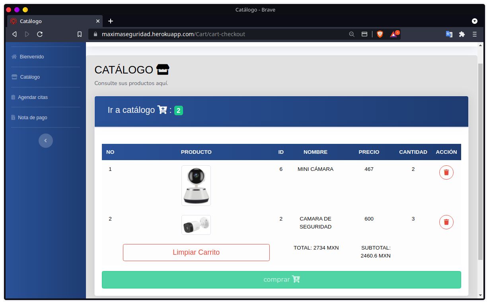

<p align="center"><a href="https://laravel.com" target="_blank"></a></p>

<p align="center">
<a href="https://travis-ci.org/laravel/framework"></a>
<a href="https://packagist.org/packages/laravel/framework"></a>
<a href="https://packagist.org/packages/laravel/framework"></a>
<a href="https://packagist.org/packages/laravel/framework"></a>
</p>

##  [SISTEMAS DE MAXIMA SEGURIDAD](sistemasdemaximaseguridad@gmail.com)

> Esta  es  una  empresa  de  servicios  de  seguridad  que  forma  parte  Vanguardia Empresarial  de  Seguridad  Privada,  enfocándose  a  la  proporción  de  servicios  de vigilancia y protección de bienes. La empresa de Sistemas de Máxima Seguridad, es   una   empresa   dedicada   al   servicio   de Sistemas    de    Máxima    Seguridad    privada, ubicada en la colonia Los Álamos INFONAVIT perteneciente   a   la   Ciudad   de   Oaxaca   de Juárez. Esta es una empresa en formación que nació  el  3  de  Marzo  de  2005  de  una  idea conjunta de la familia “Velázquez Jiménez”, la cual  discutieron  la  posibilidad  de  fundar  un  negocio  de  ventas  de  cámaras  de vigilancia doméstica, con la característica extra de poseer un servicio de instalación y mantenimiento de la misma. En  los  primeros  años  la  empresa  de  sistemas  de  máxima  seguridad  era  una pequeña empresa que vendía pocas cámaras, pero con el paso del tiempo con la inseguridad que se vive en la ciudad, la calidad de sus servicios y la visión de la familia, la empresa ha estado en constante evolución. Actualmente dicha empresa de  sistemas  de  máxima  seguridad  se  encuentra  en  proceso  de  proyección  de cumplir con su visión. 

## ¿Quienes somos?

### Misión
> Proteger  y  cuidar  lo  más  valioso  de  nuestros  clientes  con  tecnología  de  punta  y personal mejor calificado en todo lo que a seguridad se refiera.

### Visión
> Ser la empresa de seguridad privada más reconocida a nivel nacional y brindaruna calidad total en cada uno de nuestros trabajos.

## Configuración

### Configurar el archivo .env

```
DB_CONNECTION=mysql
DB_HOST=127.0.0.1
DB_PORT=3306
DB_DATABASE=YOUR DATABASE
DB_USERNAME=YOUR USERNAME
DB_PASSWORD=YOUR PASSWORD
```
## Actualizar dependecias
```
 composer update ; Descarga las depencias necesarias para ejecutar el sistema. 
```

### Comandos
```bash
   - php artisan migrate -> Migrar las tablas 
   - php artisan migrate --seed -> Migrar las tablas  y seeders.
   - php artisan migrate:fresh -> Sí ya antes se migraron las tablas ejecutar este comando para realizar los cambios realizados.
   - php artisan migrate:fresh  --seed ->  Sí ya antes se migraron las tablas ejecutar este comando para realizar los cambios y enviar los seeders.
    php artisan storage:link  -> Una vez que se ha almacenado un archivo y se ha creado el enlace simbólico, puede crear una URL a los archivos utilizando el asistente de activos.
```
## Capturas





## Licencia
Derechos reservados para la empresa [Sistemas de Maxima seguridad](https://maximaseguridad.herokuapp.com/).
